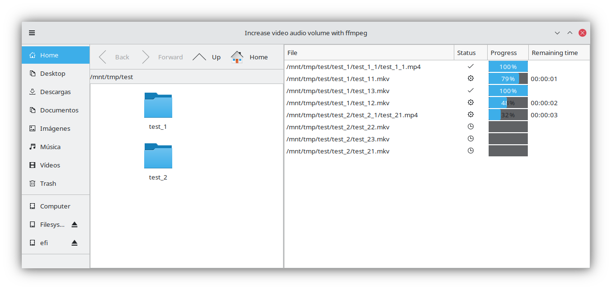

# increasevol
Simple [ffmpeg](https://ffmpeg.org/) launcher to increase the audio volume of videos. It is made with [python](https://www.python.org/) and [GTK](https://www.gtk.org/) 3, that is with [PyGObject](https://pygobject.readthedocs.io/en/latest/).

It may be useful to other novice programmers as an example of PyGObject usage:
- It uses [Gtk.IconView](https://python-gtk-3-tutorial.readthedocs.io/en/latest/iconview.html) and [Gtk.TreeView](https://python-gtk-3-tutorial.readthedocs.io/en/latest/treeview.html) with their respective data [models](https://python-gtk-3-tutorial.readthedocs.io/en/latest/treeview.html#the-model).
- It allows [drag and drop](https://python-gtk-3-tutorial.readthedocs.io/en/latest/drag_and_drop.html) from Gtk.IconView widget to Gtk.TreeView widget. You can also drag files from a file manager to the Gtk.TreeView widget.
- Performs [asynchronous](https://pygobject.readthedocs.io/en/latest/guide/threading.html) [reads](https://developer.gnome.org/documentation/tutorials/asynchronous-programming.html) of ffmpeg command outputs and displays the status in the GUI in real time without using threads and without GUI stalls.
- Uses Gobject [signals](https://python-gtk-3-tutorial.readthedocs.io/en/latest/objects.html#signals) for inter-class communication.
- Uses the new [Gtk.Application](https://python-gtk-3-tutorial.readthedocs.io/en/latest/application.html) and Gtk.ApplicationWindow classes.
- Saves the window [state](https://wiki.gnome.org/HowDoI/SaveWindowState).

## Description
Increasevol is a toy project to improve my Python skills. I was tired of having to launch a ffmpeg command to increase the sound volume of the videos I watch on TV and I decided to make a small graphical application to avoid typing.


The application displays three panels:
- the right pane is a Gtk.PlacesSidebar widget. This gives the application the appearance of a file manager.
- the middle pane is a Gtk.IconView widget that displays the list of files in the current directory. Each file is displayed as an icon depending on its MIME type. This code is a modification of one of the GTK 3 demo [examples](https://gitlab.gnome.org/GNOME/pygobject/-/blob/master/examples/demo/demos/IconView/iconviewbasics.py).
- the left pane is a Gtk.TreeView that displays the list of launched or waiting jobs. Each job is in charge of increasing the volume of a video, i.e. each job is a running or waiting ffmpeg process. This code is also a modification of one of the GTK 3 demo [examples](https://gitlab.gnome.org/GNOME/pygobject/-/blob/master/examples/demo/demos/TreeView/liststore.py).

Each job performs two steps, as can be seen in the `Job` class. The first one is to launch the command:
```
ffprobe -v error -show_entries format=duration -of default=noprint_wrappers=1:nokey=1 input_video.mkv
```
to get the duration of the video. The second one is to launch the command:
```
ffmpeg -i input_video.mkv -map 0 -c:v copy -c:s copy -c:a mp3 -q:a 3 -filter:a volume=3.0 output_video.mkv
```
which increases the audio volume of the input file. While ffmpeg is processing the video it displays on its standard output lines like:
```
size=   45210kB time=00:01:21.57 bitrate=4539.8kbits/s speed=22.9x
```
indicating the proportion of the video that has already been processed. In the case of the example line, ffmpeg would have already processed 01:21.57 minutes of the video. With this data and the total duration of the video you can estimate how much time is left for the end of the video processing. This estimate is displayed in the job list to keep the user informed.

Each ffmpeg process is launched using a class derived from the `ProcessLauncher` class. This class is a modification of [this](https://gist.github.com/fthiery/da43365ceeefff8a9e3d0dd83ec24af9) class and is responsible for reading the standard ffmpeg output asynchronously and sending a signal each time it has read a line with processing time data.

The application launches as many concurrent jobs as specified in the configuration. This is handled by the `JobsQueue` class.

## Portability
**The application only works on Linux**. I don't want to bother porting it to other operating systems that I don't use. However, if anyone is interested, there are several lines marked with:
```
# FIXME: This is not portable.
```
in the code that are clearly not portable. They are mainly lines that check directories, such as:
```
self._up_button.set_sensitive(path != '/') # FIXME: This is not portable.
```
or the end-of-line character:
```
self._data_stream.read_upto_async(stop_chars='\r\n', # FIXME: This is not portable.
```

## Installation
It has been tested only on Ubuntu 24.04 and 22.04, but it should run on any current Linux distribution.

In Ubuntu just copy the Python code [file](increasevol.py), give it run permissions and run it. Of course, it is necessary to have ffmpeg and ffprobe installed. Just run the following command in a terminal:
```
sudo apt install ffmpeg
```
For other distributions you can check that they meet the [requirements](https://pygobject.readthedocs.io/en/latest/getting_started.html ) for running applications made with PyGObject. In Ubuntu 22.04 it is enough to have installed:
```
python3-gi python3-gi-cairo gir1.2-gtk-3.0
```
which are installed by default.

## Conclusions
I started this small project to improve my knowledge of Python in the development of graphical applications. Now, that I have decided to finish it, the feeling I have is that I have been struggling with the poor documentation of GTK 3 and PyGObject.

The GTK 3 API has been changing in the last years and that is why it is difficult to find examples and updated documentation. Also the examples are usually written in C and are not fully functional examples, they are just fragments.

For this reason I advise programmers starting to use PyGObject to use only the official [documentation](https://pygobject.readthedocs.io/en/latest/index.html), its [tutorial](https://python-gtk-3-tutorial.readthedocs.io/en/latest/index.html) and the [demo](https://gitlab.gnome.org/GNOME/pygobject/-/tree/master/examples/demo) examples. It is also useful the PyGObject API [Reference](https://lazka.github.io/pgi-docs/).

I have not found good documentation for using asynchronous I/O with PyGObject other than the [example](https://gist.github.com/fthiery/da43365ceeefff8a9e3d0dd83ec24af9) I've used, this [page](https://developer.gnome.org/documentation/tutorials/asynchronous-programming.html) from GNOME Developer Documentation, a [question](https://discourse.gnome.org/t/how-do-you-run-a-blocking-method-asynchronously-with-gio-task-in-a-python-gtk-app/10651/4) on the GNOME forums and this outdated [tutorial](https://www.micahcarrick.com/asynchronous-read-in-python-with-gio.html) from Micah & Carrick Web Development.
